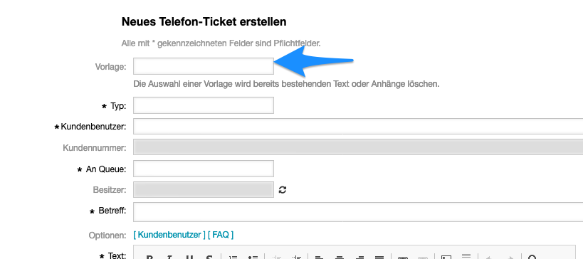
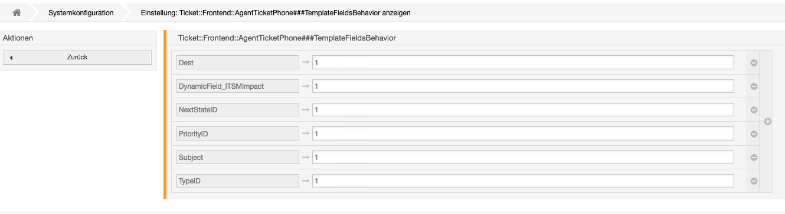

# OTRS6 - TemplateExtended6

## Installation:

Nach der Installation der _OPM_-Datei über den _Packagemanager_ müssen noch folgende Schritte ausgeführt werden.

### angepasstes _OTRS_
```
cd /opt/otrs/Custom/Kernel/Modules/
patch AgentTicketPhone.pm AgentTicketPhoneTemplateExtended.pm.diff

cd /opt/otrs/Custom/Kernel/Output/HTML/Templates/Standard/
patch AgentTicketPhone.tt AgentTicketPhoneTemplateExtended.tt.diff
```
### unberührtes _OTRS_
```
cd /opt/otrs/Custom/Kernel/Modules/
cp AgentTicketPhoneTemplateExtended.pm AgentTicketPhone.pm
cd /opt/otrs/Custom/Kernel/Output/HTML/Templates/Standard/
cp AgentTicketPhoneTemplateExtended.tt AgentTicketPhone.tt
```
## Systemkonfiguration
### Ticket::Frontend::AgentTicketPhone###FilterStandardTemplatesBy
Definiert anhand welchen Attributs in der AgentTicketPhone das Template gesetzt wird

Möglichkeiten:
- None (leer):  Templateauswahl ohne Filter

- Queue: Templateauswahl anhand der Queue
- Role:  Templateauswahl anhand der Rolle
    
### Ticket::Frontend::AgentTicketPhone###TemplateFieldsBehavior
Definiert das Feldverhalten.

Achtung! 
Hier müssen alle Felder, welche durch das Template gesetzt werden sollen, hinzugefügt werden. 
Dynamische Felder müssen mit einem "DynamicField_" geprefixed werden. Bsp.:


### StandardTemplateExtended::DynamicFields
Whitelist der dynamische Felder, die bei der Erstellung erweiterter Vorlagen angezeigt werden sollen. Die dynamischen Felder sollten natürlich angelegt sein. (Type = Text)

### TODO
Nothing